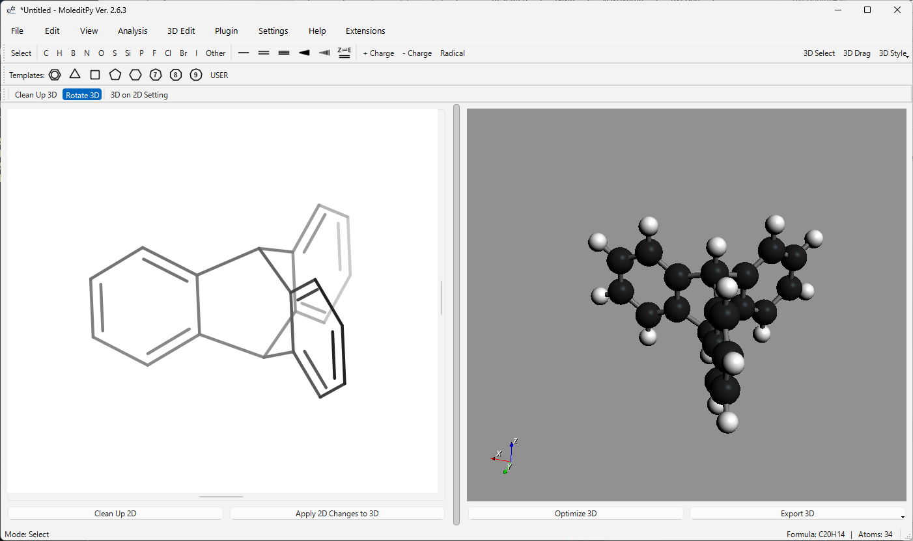

# 3D Molecule on 2D Plugin for MoleditPy

This plugin enhances MoleditPy with integrated 3D depth cues, interactive 3D rotation within the 2D view, and 3D-aware data export.

## Features

### Integrated 3D Depth Cues
- Atoms and bonds are automatically colored with a "distance fade" (brighter/whiter for distant parts) to provide a clear sense of 3D depth.
- Adjustable depth cue strength in the settings.
- Depth cues adapt to both individual molecules and the entire scene.

### Interactive 3D Rotation
- Rotate molecules in 3D directly on the 2D canvas.
- **Molecule-wise Rotation**: Drag an atom or bond to rotate that specific molecule around its center of gravity.
- Integrated with the main application's tool system for mode exclusivity.

### Smart 3D Synchronization (Clean Up 3D)
- Synchronize your 2D layout back to the 3D geometry.
- Automatically detects if the molecule's topology has changed.
- If only positions moved, it performs a fast alignment.
- If bonds or atoms were edited, it triggers a fresh 3D coordinate generation.

### 3D-Aware Mol Export
- The standard Mol file export is enhanced to include the 3D Z-coordinates.
- Exported `.mol` files preserve the 3D structure seen in MoleditPy, making them compatible with other 3D modeling and analysis software.

## Installation

1. Copy `3d_molecule_on_2d.py` into your MoleditPy `plugins` directory.
2. Restart MoleditPy.
3. Access the tools via the plugin toolbar.

## Usage

- **Rotate 3D**: Activate the tool and drag any atom/bond to rotate the molecule.
- **Clean Up 3D**: Click to snap the 2D layout to the underlying 3D structure.
- **Settings**: Adjust the fade strength and 3D projection scale.

## Implementation Details

- **Monkey Patching**: The plugin non-destructively patches `AtomItem` and `BondItem` paint methods and the `MolecularData` export logic.
- **Z-Coord Persistence**: Z-coordinates are stored as part of the plugin state and restored across sessions.
- **RDKit Integration**: Uses RDKit for 3D coordinate generation and Mol block handling.

---
**Author**: HiroYokoyama  
**Version**: 1.0.0
